# Bank Marketing Prediction Azure Pipeline 

We are having BankMarketing Data about customers and effectiveness of marketing on customer. We will create and run an AutoML Experiment using Azure Pipeline. 

In this project, We will continue to work with the Bank Marketing dataset. We will use Azure to configure a cloud-based machine learning production model, deploy it, and consume it. We will also create, publish, and consume a pipeline. 

## Architectural Diagram

In this project, We will following the below steps:

1. Authentication
2. Automated ML Experiment
3. Deploy the best model
4. Enable logging
5. Swagger Documentation
6. Consume model endpoints
7. Create and publish a pipeline


## Key Steps:

1. Authentication: In this step, We need to install the Azure Machine Learning Extension which allows us to interact with Azure Machine Learning Studio, part of the az command. After having the Azure machine Learning Extension, we have to create a Service Principal account and associate it with our specific workspace. 

    How to create a service principal:
    1. az command-line tool is installed along with the ml extension (command to add ml extension`az extension add -n azure-cli-ml`)
    2. perform login using az command (command `az login`)
    3. Create the Service Principal (command `az ad sp create-for-rbac --sdk-auth --name ml-auth`)
    4. Capture the "objectId" using the clientID (command `az ad sp show --id xxxxxxxx-3af0-4065-8e14-xxxxxxxxxxxx`)
    5. Assign the role to the new Service Principal for the given Workspace, Resource Group and User objectId:
        ```
        az ml workspace share -w Demo -g demo --user xxxxxxxx-cbdb-4cfd-089f-xxxxxxxxxxxx --role owner
        ```

2. Automated ML Experiment : Here we selected and upload [BankMarketing Dataset](https://automlsamplenotebookdata.blob.core.windows.net/automl-sample-notebook-data/bankmarketing_train.csv) and created an automl experiment with classification type. This is classification problem and we want to completed it within 30 mins so we specific parameters in the Notebook in the configuration class object of automl with specific compute object.
Below Image shows that data has been registered
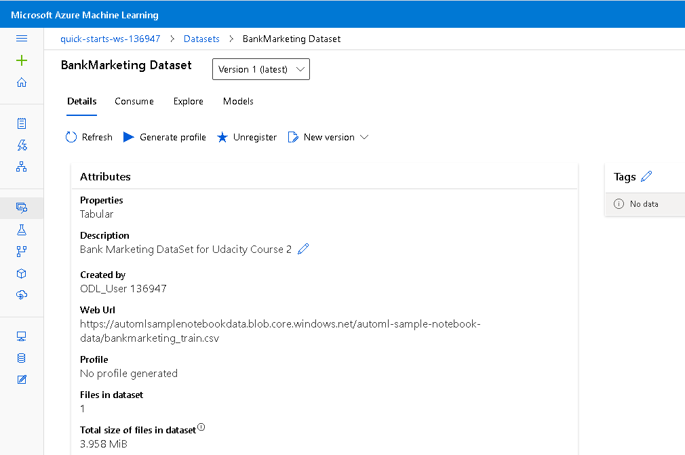
After Registering Data, We completed an automl Run
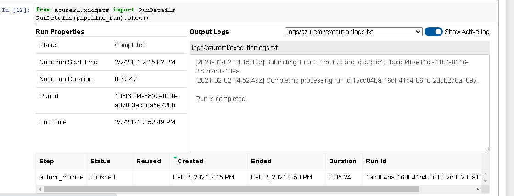
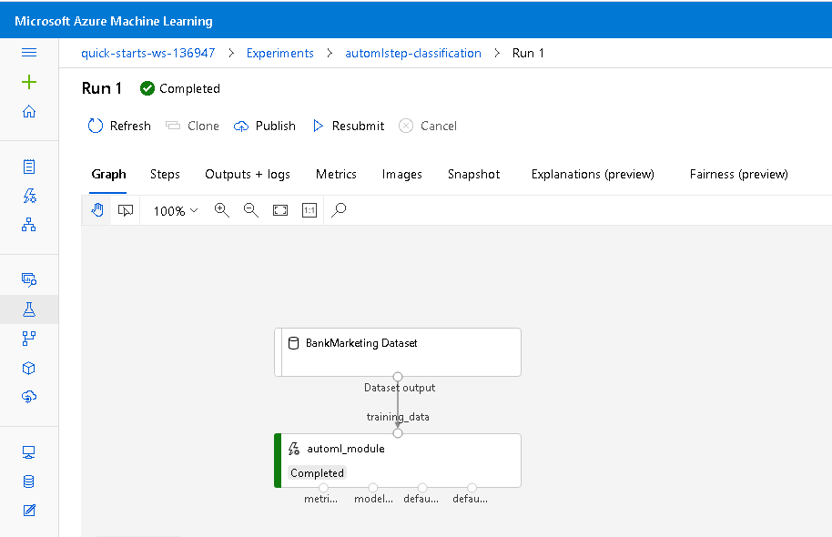)

3. Deploy the best model: After the experiment run completes, a summary of all the models and their metrics are shown, including explanations. 
The Best Model will be shown in the Details tab. In the Models tab, it will come up first (at the top).
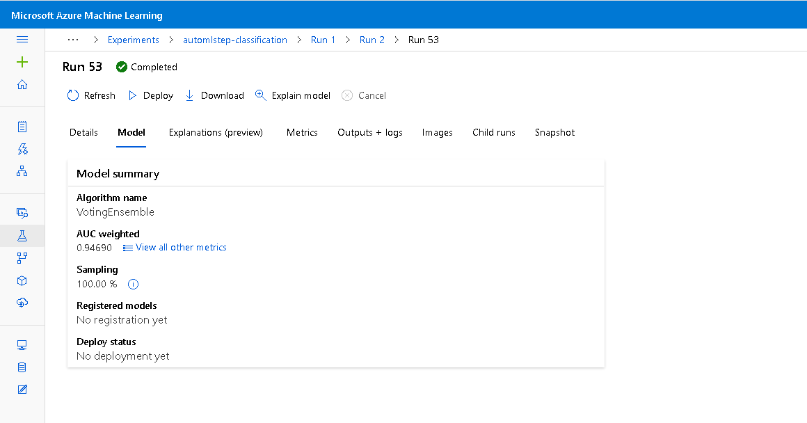
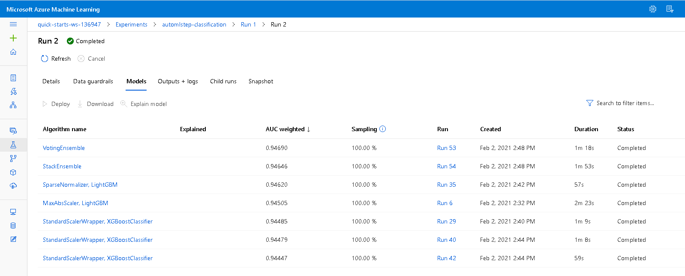
Deploying the Best Model will allow to interact with the HTTP API service and interact with the model by sending data over POST requests.
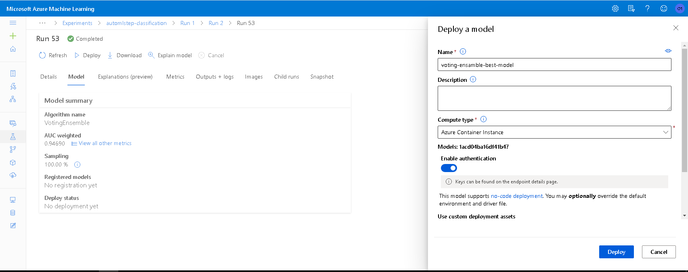

4. Enable logging:
Now that the Best Model is deployed, enable Application Insights and retrieve logs. Although this is configurable at deploy time with a check-box, it is useful to be able to run code that will enable it for us. When we run the log.py file by specifing rest endpoint URL in the Experiment 
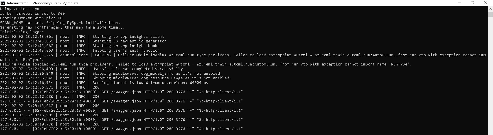
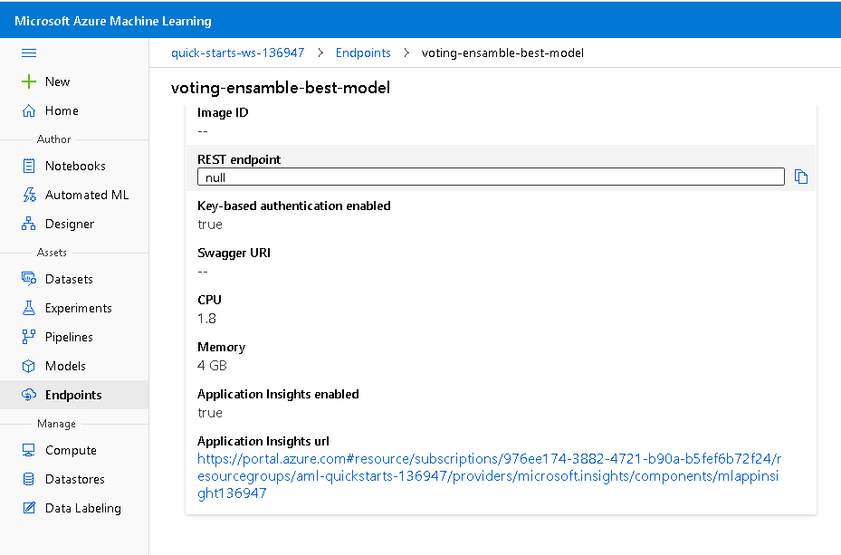

5. Swagger Documentation: A swagger UI is great way to make inference and accessing Rest API. We can demo it to someone without making a production ready UI.
For creating Swagger UI for Rest End of Azure deployed model. We need to download one file named `swagger.json`. This file can be downloaded from detail page of deployed model endpoint in Azure Python SDK. 
Note: We need to place swagger.json in swagger folder of this repository.
We need to create a docker container which can pull and run swagger image locally. The code is present in swagger.sh file in swagger folder. When we run it we will be able to see simple swagger Home screen like below.
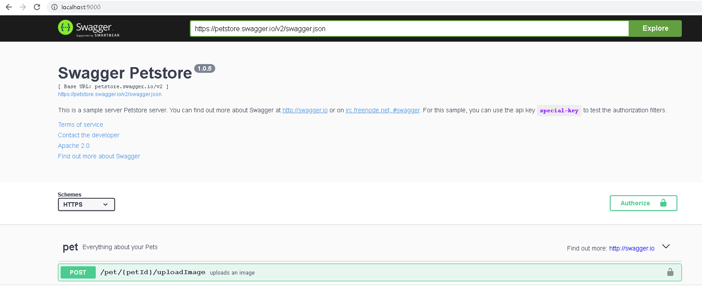
We need to run serve.py present in the swagger folder which will enable us to view experiment specific UI. Below are the the screen that we will get after that.
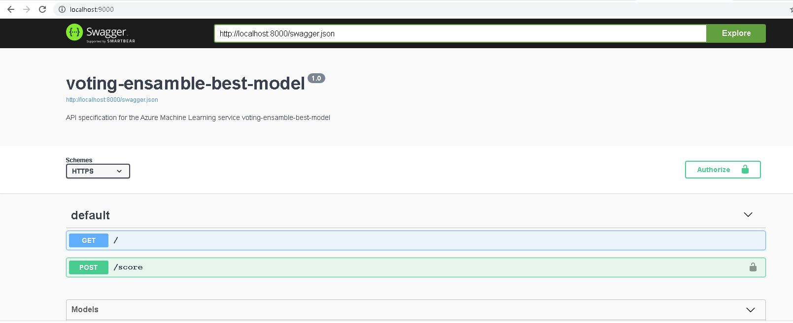
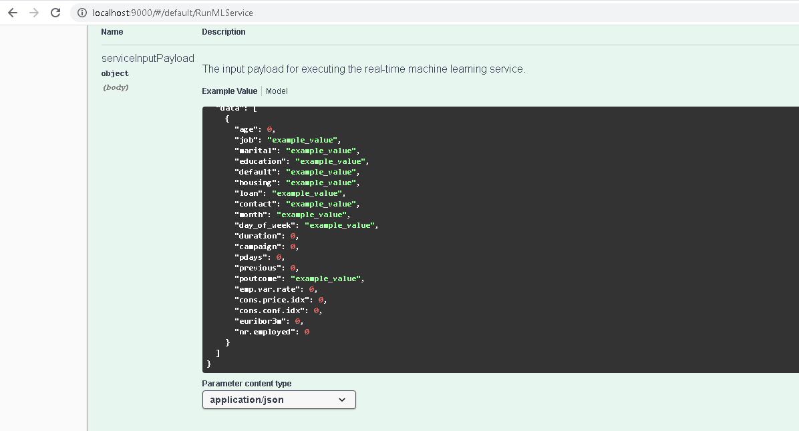
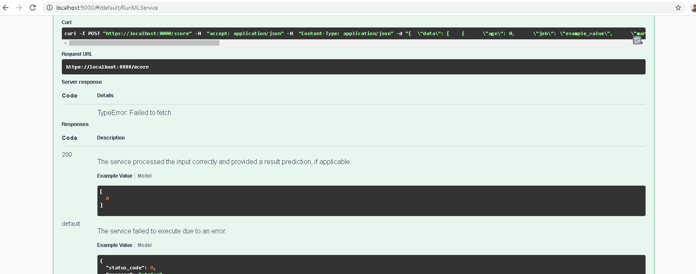

6. Consume model endpoints: once the model is deployed, use the endpoint.py script provided to interact with the trained model. In this step, you need to run the script, modifying both the scoring_uri and the key to match the key for your service and the URI that was generated after deployment
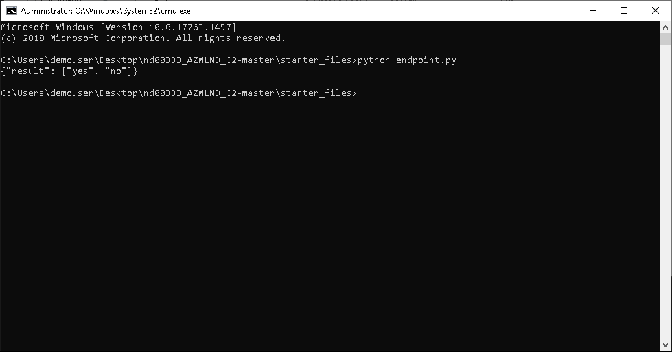

It is always best practice to check benchmarking on the deployed model once end point is tested. We can do that by running benchmark.py file present in the same directory. It will gave output like below
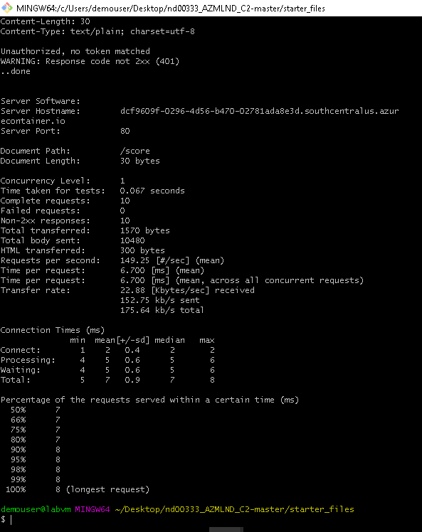

7. Create and publish a pipeline: The final step is to enable pipeline running using rest call.
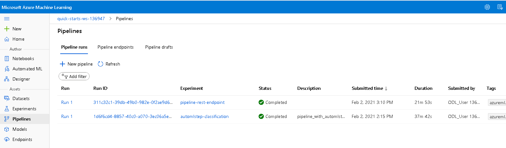
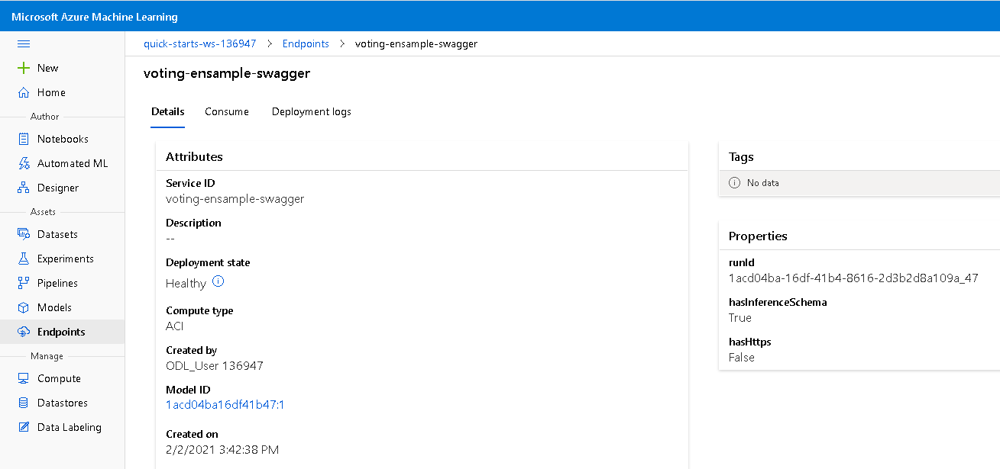
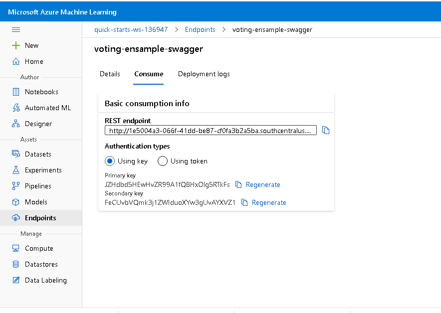
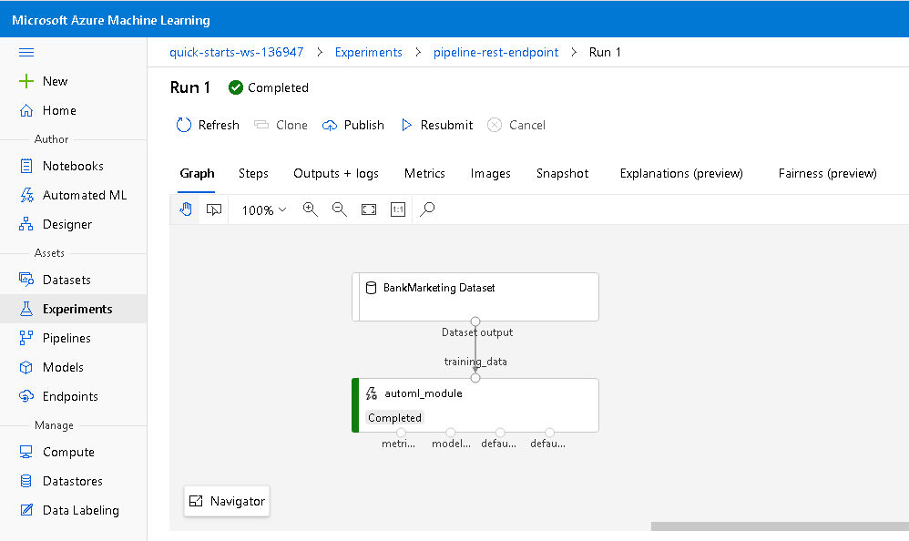

## Screen Recording
https://youtu.be/0wsMm_FQkaU

